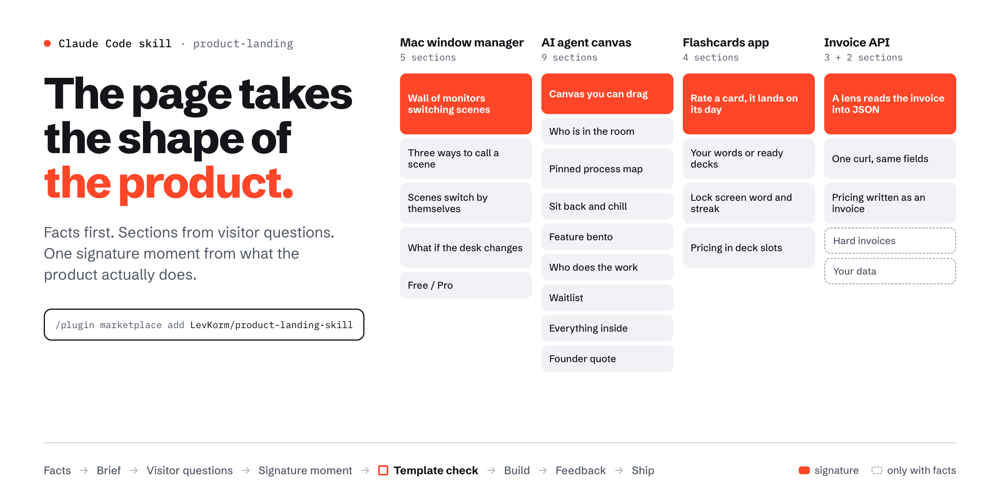
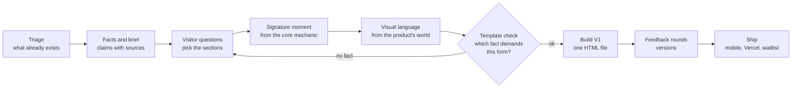
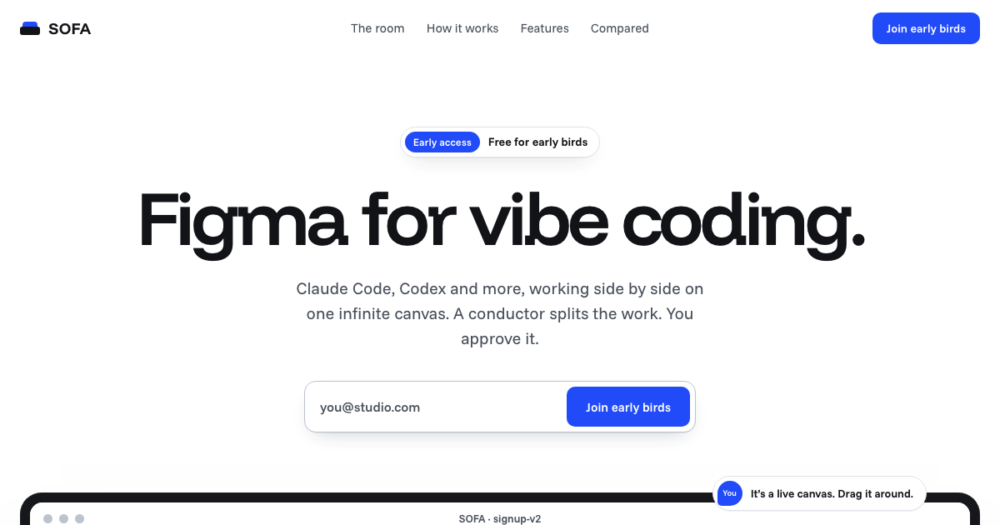

# product-landing



A [Claude Code](https://claude.com/claude-code) skill for product landing pages that take the shape of the product instead of a template.

**Website:** [landingskill.vercel.app](https://landingskill.vercel.app). The page itself was made with this skill; its brief is in [`docs/landing/brief.md`](docs/landing/brief.md).

It walks Claude from facts to a live site. First it gathers facts about the product. Then it derives the sections from the questions a visitor has, finds one signature moment in what the product actually does, and builds a visual language from the product's own world. It iterates with you in versions, adapts the page for mobile, deploys it to Vercel and, if you need one, wires a waitlist to Supabase.

## Why

Most generated landing pages look alike, because the structure comes first and the product gets poured into it: hero, three feature cards, comparison, pricing, testimonials.

This skill works the other way round:

- **Visitor questions pick the sections.** A familiar category needs the mechanic shown in a second. A new category needs it explained. A cheap app wants a short page. B2B wants proof.
- **The product's core mechanic becomes the signature moment.** Claude completes "a person does ___, and ___ happens", then finds the visual that shows it with the least text.
- **A template check runs before any code.** Every section in the map names the product fact that demands its form. "Because it worked on another landing" is not a reason, so that form gets replaced.

The preview above shows the result. The same method produced four different pages:

| Product | Sections | Signature moment |
|---|---|---|
| Mac window manager | 5 | a wall of monitors switching scenes |
| AI agent canvas ([SOFA](https://trysofa.vercel.app)) | 9 | a canvas you can drag, plus a process map |
| Flashcards app *(dry run)* | 4 | rate a card, and it lands on its day |
| Invoice API *(dry run)* | 3 + 2 | a lens reads the invoice into JSON |

The flashcards app and the invoice API are dry runs on fictional briefs. They stop at the brief and the section map, with no HTML.

## How it works



| Phase | What you get |
|---|---|
| Facts and brief | `docs/landing/brief.md`: one-liner, audience, core mechanic, pillars with sources, honest differences, open questions |
| Structure | A section map with the visitor question, the form and the product fact behind each section |
| Visual language | A palette with roles, fonts, layout and devices taken from the product's world, checked against common AI-design clichés |
| Build | A single HTML file that works as a Claude artifact and as the source for the production build |
| Feedback | Versions with a local switcher; your taste recorded separately from decisions that only fit this one product |
| Ship | Mobile pass, `build.sh` (meta, OG image, favicon), Vercel deploy, an optional insert-only Supabase waitlist, live checks |

## Install

As a plugin, from inside Claude Code:

```
/plugin marketplace add LevKorm/product-landing-skill
/plugin install product-landing@product-landing-skill
```

Or copy the skill by hand:

```bash
git clone https://github.com/LevKorm/product-landing-skill.git
cp -R product-landing-skill/skills/product-landing ~/.claude/skills/
```

## Use

Just ask for a landing page. The skill triggers on requests like these:

- "Make a landing page for our app, look at the repo first"
- "Our positioning is blurry, restructure the landing before designing"
- "The page is ready, deploy it to Vercel and connect the waitlist to Supabase"

Claude asks at most four questions at a time, and only the ones the sources can't answer. Everything else gets a stated default.

## What's inside

```
skills/product-landing/
├── SKILL.md                      phases, template check, principles
├── references/
│   ├── discovery.md              where to find facts, what to verify, what to ask
│   ├── content-architecture.md   visitor questions → forms, signature moment, copy
│   ├── design-system.md          product world → devices, color, type, layout, motion, clichés
│   ├── case-studies.md           how two real products became two different pages
│   ├── feedback-loop.md          feedback rounds, versions, taste vs product decisions
│   ├── taste-profile.md          your taste that carries across products (empty template)
│   └── build-and-ship.md         mobile, build, Vercel, domain change, waitlist
├── assets/
│   ├── brief-template.md
│   ├── build.sh                  wraps the HTML, makes OG image and favicon, deploys
│   ├── early_birds.sql           insert-only waitlist table with RLS and column grants
│   └── waitlist-form.js          form states, honeypot, duplicate handling
└── evals/evals.json
```

**Taste profile.** `references/taste-profile.md` ships empty. Claude fills it as you give feedback: "carries over", "hypothesis" and "rejected", each with a source. Decisions that only fit one product stay in that product's brief, so the next landing doesn't inherit them.

## Built with it

[SOFA](https://trysofa.vercel.app) is a canvas where AI coding agents work side by side.



## Requirements

- Claude Code.
- Optional, only for the phases that use them:
  - Vercel CLI, for deploy;
  - Supabase MCP or CLI, for the waitlist;
  - Google Chrome, to render the OG image and icons.

## License

[MIT](LICENSE)
